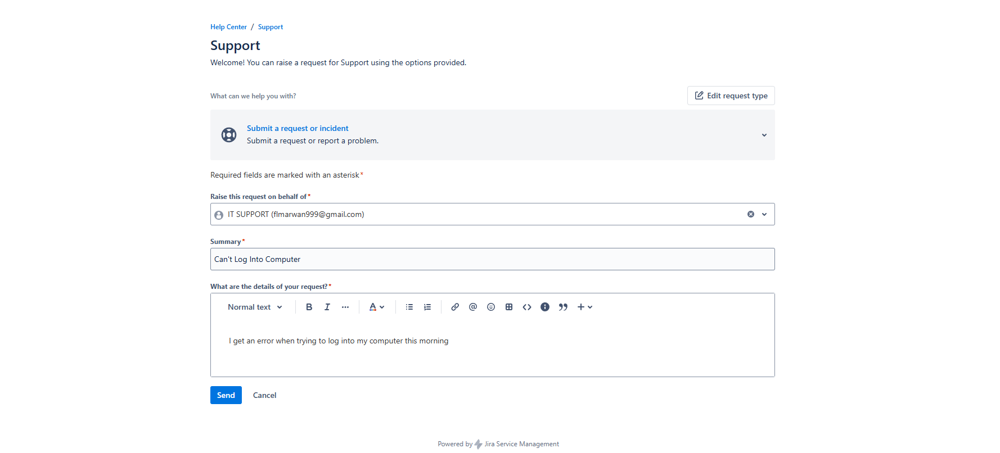
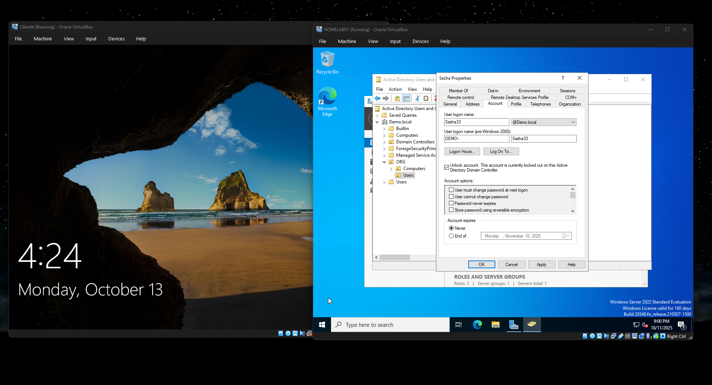
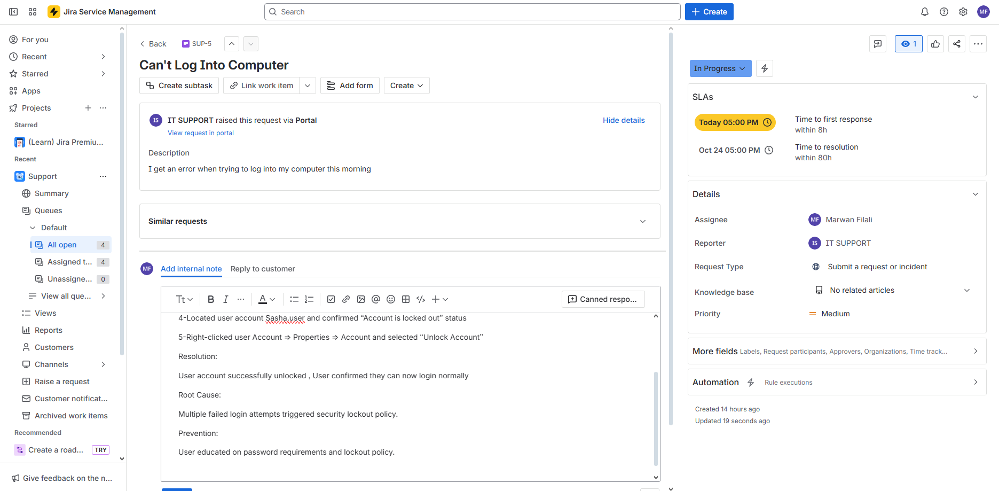
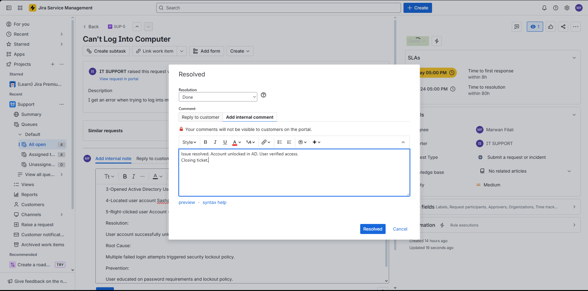

# IT-Incident-Management---AD-Account-Lockout

IT Incident Management: Active Directory Account Lockout Resolution

## Overview
This project demonstrates a complete IT support workflow for resolving a common enterprise issue: user account lockouts in Active Directory. The scenario covers the entire incident management lifecycle from ticket creation to resolution and documentation.

## Environment & Technologies
- Windows Server 2022
- Active Directory Domain Services
- Jira Service Management
- Windows 10/11 Client
- Oracle VirtualBox

## Step-by-Step Implementation

### 1. Incident Reporting
- User submits ticket via Jira Service Management portal reporting "Can't Log Into Computer"
- Ticket includes detailed description of the error encountered

### 2. Initial Diagnosis
- Verified user credentials and login error message
- Determined the issue was account-specific, not system-wide

### 3. Active Directory Investigation
- Logged into Domain Controller
- Opened Active Directory Users and Computers (ADUC)
- Located user account in the appropriate OU
- Checked account properties and identified "Account is locked out" status

### 4. Resolution
- Unlocked user account in Active Directory
- Verified account status changed to "Active"
- Informed user to attempt login again

### 5. Verification & Documentation
- Confirmed user could successfully log in
- Updated service desk ticket with resolution details
- Documented root cause (multiple failed login attempts triggered security policy)
- Added preventive measures (user education on password policies)
- Closed the incident ticket

## Challenges & Solutions
- **Challenge**: User unable to access critical systems due to security lockout
- **Solution**: Quick identification of lockout status in AD and immediate resolution
- **Challenge**: Need to prevent recurrence
- **Solution**: User education on password policies and lockout thresholds

## Key Learnings
- Active Directory account management and troubleshooting
- ITIL-based incident management workflow
- Enterprise ticketing system operation
- User communication and education strategies
- Security policy enforcement and exception handling

## Screenshots

